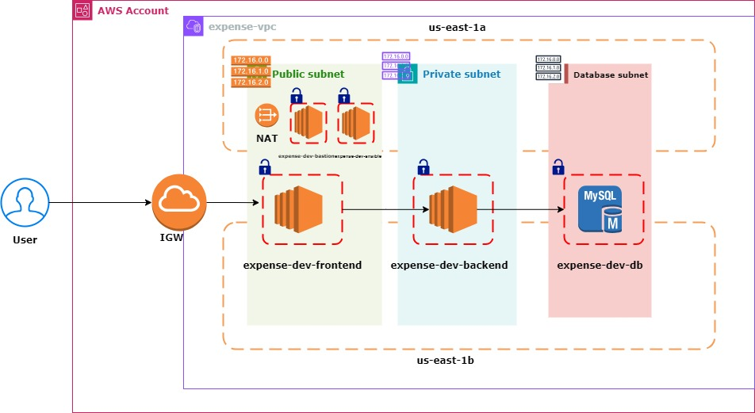

# Expense Architecture




```
for i in 01-vpc/ 02-sg/ 03-bastion/ 04-db/ 05-apps/ ; do cd $i; terraform init -reconfigure; cd .. ; done 
```

```
for i in 01-vpc/ 02-sg/ 03-bastion/ 04-db/ 05-apps/ ; do cd $i; terraform plan; cd .. ; done 
```

```
for i in 01-vpc/ 02-sg/ 03-bastion/ 04-db/ 05-apps/ ; do cd $i; terraform apply -auto-approve; cd .. ; done 
```

```
for i in 05-apps/ 04-db/ 03-bastion/ 02-sg/ 01-vpc/ ; do cd $i; terraform destroy -auto-approve; cd .. ; done 
```